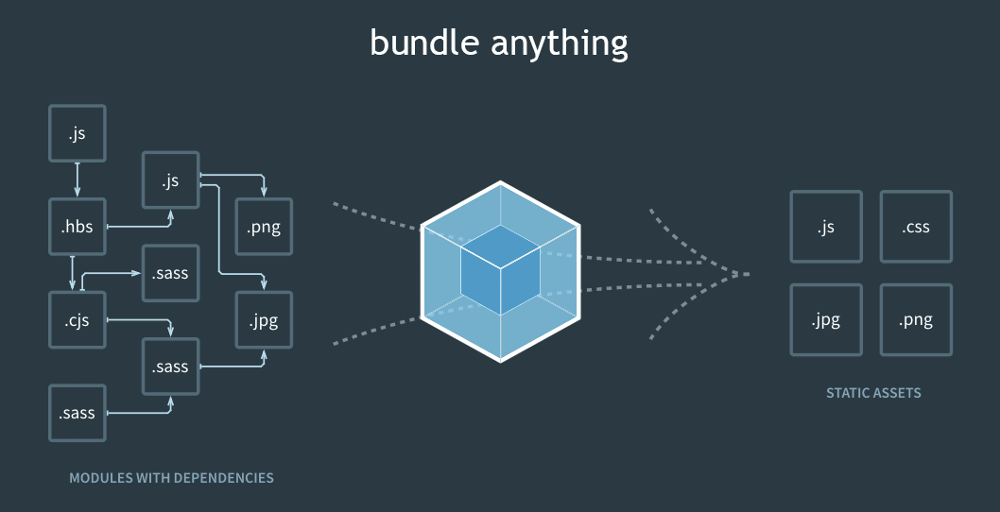

# webpack
webpack es un módulo de JS de código abierto.
Es un paquete de módulos principalemente de JS pero puede transformar activos front-end como HTML

## 1.1 Introducción a webpack

| User Experience producción | Developer experience |
|----------------------------|----------------------|
| Se logra con una aplicación que funciones | |
| Funciones| Escribir app de manera eficiente|
| Sea rapida | Tener un código limpio |
| Cumpla sus necesidades | Aplicar tecnología para resolver sus problemas|
| Se actualize | Tener un conjunto de reglas y convenciones |
| Responda a sus interacciones | Entorno de desarrollo optimizado en productividad|
| Productu de calidad | |

